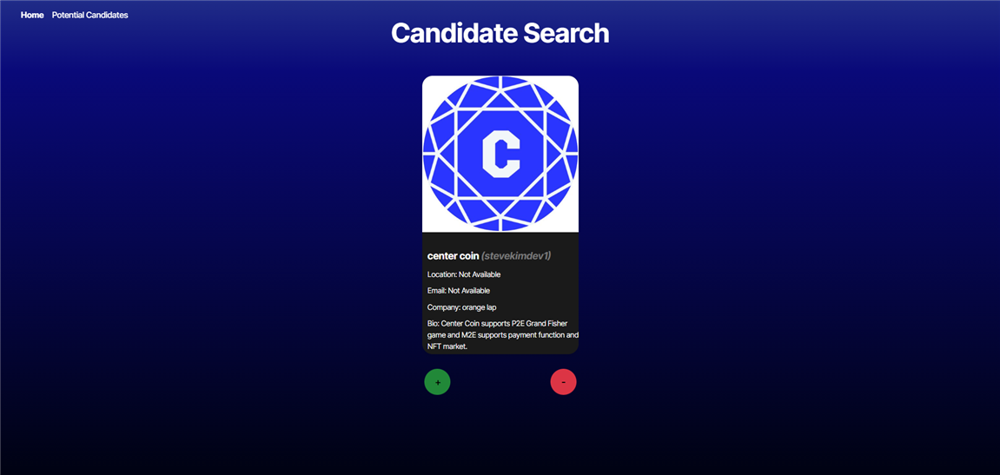
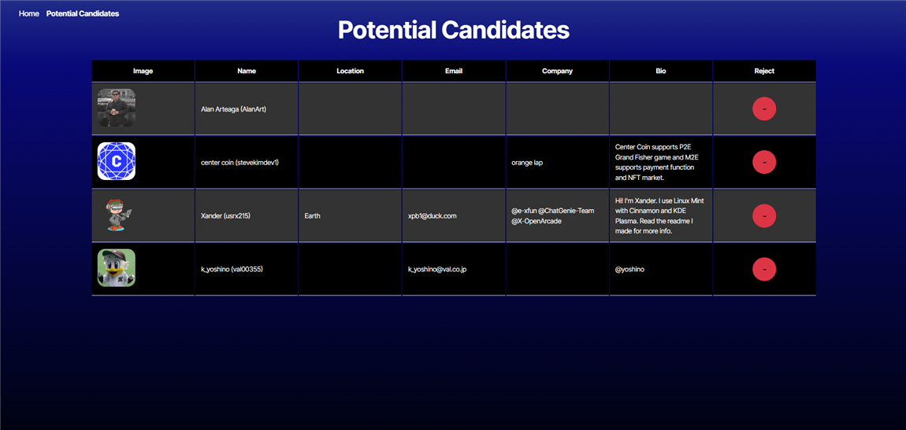

# Candidate-Search
  [](https://opensource.org/licenses/MIT)
  
  ## Table of Contents
  
  * [Description](#description)
  * [Installation](#installation)
  * [Usage](#usage)
  * [Contributing](#contributing)
  * [Test](#test)
  * [License](#license)
  * [Questions](#questions)
  
  ## Description
  This application uses GitHub API to search for potential candidates suitable for hiring. Users can browse through candidates' profiles, save promising candidates to a shortlist, and review the saved list later.

  ## Installation
  Installation Required:  JavaScript, Node JS,  `react-router-dom`, and `npm` package. This React Portfolio should be run locally. Follow the steps outlined in the [Test](#test) section.

  ## Usage 
  Here is an example screenshot of the Candidate Search App:

  
  
  
  ## Contributing
  The source of contributors I have used in this application:
  * Stack Overlow
  * W3School Website
  * Dev Community Website
  * ChatGPT
  * Taillwindcss
  
  ## Test 
  Navigate to the filepath of where the code is saved. Before running the program, you must go to GitHub and generate a `fine-grained token`. Copy and paste the token in the `.env.EXAMPLE` file with the code `VITE_GITHUB_TOKEN=`. Then rename the file `.env`.
  
  Type the code below in the terminal, running each line of code separately.


  ```bash
  npm install

  ```

  Run the Application: 

  ``` bash 
  npm run dev

  ``` 

  ## License
  This project is Licensed under the MIT License.
  
  ## Questions
  Feel Free to contact me for any additional questions
  * GitHub: [jbarry89](https://github.com/jbarry89/)
  * Email: myEmail@gmail.com 

